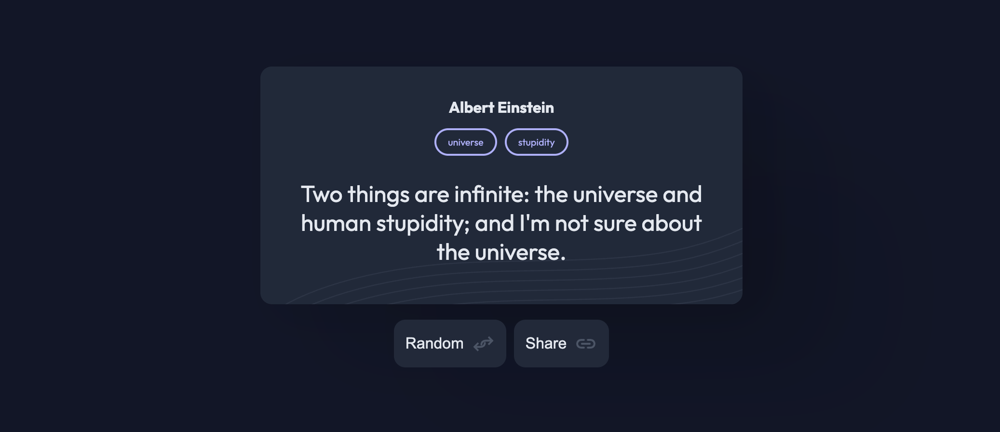

<!-- Please update value in the {}  -->

<h1 align="center">Random Quote | devChallenges</h1>

<div align="center">
  <h3>
    <a href="https://random-quote-snowy.vercel.app/">
      Demo
    </a>
    <span> | </span>
    <a href="https://devchallenges.io/solution/64735">
      Solution
    </a>
    <span> | </span>
    <a href="https://devchallenges.io/challenge/random-quote">
      Challenge
    </a>
  </h3>
</div>

<!-- TABLE OF CONTENTS -->

## Table of Contents

- [Overview](#overview)
  - [What I learned](#what-i-learned)
- [Built with](#built-with)
- [Contact](#author)
<!-- OVERVIEW -->

## Overview



### What I learned

### Clipboard API

The copy feature found in many production apps is a great user experience. It prevents the user from manually selecting the whole text, right-clicking the button, and copying the text; it can be a little more work for mobile users. As part of the challenge of this project, I did some research to understand the Clipboard API as part of the functionality of this small app.

```css
  navigator.clipboard
    .writeText(text)
```

The clipboard object comes with a handy set of methods supported by modern browsers; they are asynchronous operations, whether the transferred data is successfully transferred or not. It’s worth mentioning that access to this API is not restricted in secure contexts. However, it seems to work conveniently for developers testing locally since the browser is on the same device.

### Built with

<!-- This section should list any major frameworks that you built your project using. Here are a few examples.-->

- Semantic HTML5 markup
- CSS
- Flexbox
- JavaScript

## Author

- X [@ErnestGadget](https://{x.com/ErnestGadget})
- GitHub [@macin-dev](https://{github.com/macin-dev})
